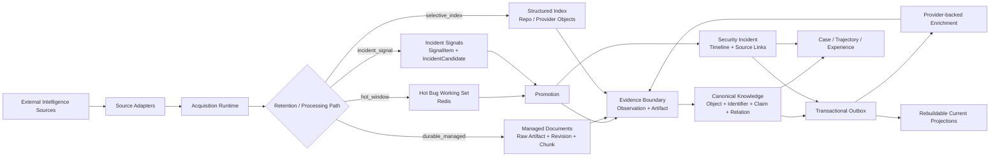

# SecFusionAgent

**Evidence-first AI Security Intelligence System**
**智能体驱动的 AI 安全情报融合与研判系统**

SecFusionAgent 面向 AI 安全漏洞、研究进展与安全事件构建持续演进的情报系统。系统从公开漏洞库、项目仓库、安全公告、研究论文和事件信息源持续获取新增或变化内容，将外部数据固定为可追溯 evidence，再完成规范化、关联、富化、事件跟踪与后续调查。

这里的 Agent 建立在可验证的数据平面之上。外部读取拥有 acquisition provenance，重要结论能够回到原始 observation / artifact，历史 revision 保留，current view 可重建；Agent 后续负责调查、工具调用与推理，不替代 evidence authority。

[Project Wiki](https://github.com/jiale-li-orion/SecFusionAgent/wiki) · [Requirements](https://github.com/jiale-li-orion/SecFusionAgent/wiki/Requirements-SPEC) · [Technical Design](https://github.com/jiale-li-orion/SecFusionAgent/wiki/Technical-Design) · [Repository Standard](PRODUCT-REPO-STANDARD.md) · [仓库规范](PRODUCT-REPO-STANDARD.zh.md)

## Project status

SecFusionAgent 当前处于 **M1–M3 Data Plane first-pass implementation / integration probe** 阶段。第一轮代码已经覆盖多种来源生命周期、canonical knowledge、provider-backed enrichment、Incident Watch、managed document、current projection，以及 Investigation Experience 的存储边界；PostgreSQL、Redis、MinIO 与 Celery 的真实基础设施集成仍在继续验证。

当前本地质量门：

```text
ruff        lint / import / Python correctness checks
mypy        static type checking
pytest      domain, replay, state-transition and contract tests
```

当前 fast suite 为 **29 tests**。这些测试主要使用 fixture 与轻量本地数据库验证 deterministic contract；它们不替代 PostgreSQL transaction、queue recovery、object storage、并发和部署层 integration tests。

## System overview



系统把 source protocol、runtime lifecycle、canonical knowledge 和 derived read model 分开维护：provider adapter 解释外部协议；acquisition runtime 记录每次 scheduled / on-demand read；EvidenceIngress 固定原始 revision；canonical knowledge 保存长期事实与 provenance；projection、cache 和后续 retrieval index 均属于可重建状态。

## Implemented data paths

| Path | Current implementation | Purpose |
| --- | --- | --- |
| Hot Bug Stream | NVD CVE API → normalization → Redis hot working set → durable promotion | 保持高频漏洞 feed 的 freshness，同时避免把全部历史漏洞复制进本地长期库 |
| Vulnerability Enrichment | OSV / GitHub Global Advisory / CISA KEV → child AcquisitionRun → EvidenceIngress → claims / relations | 对已进入 durable knowledge 的漏洞补充 package、修复、KEV 与 advisory 信息 |
| Managed Content | arXiv Atom discovery → versioned PDF artifact → document revision → page-oriented chunks | 建设可长期演进、可回到具体 revision / page 的研究语料 |
| Structured Source Index | GitHub target repositories → repo revision cursor → `Repo` object / claims | 持续维护重点 AI infrastructure repository 的结构化状态 |
| Incident Watch | RSS breaking source → strong-anchor correlation → candidate watch → durable incident timeline | 将突发消息与后续独立证据组织成可持续富化的安全事件 |
| Current Projection | knowledge / incident change → transactional outbox → projection rebuild | 为 API 与后续 retrieval 提供低成本 current view，同时保留底层历史和冲突 |
| Investigation Memory | Case → append-only Trajectory → Experience candidate / version / evaluation | 为后续 Agent 调查保存可评测、可版本化的 procedural experience |

当前内置 source definitions 位于 [`config/sources/`](config/sources/)；source 是否进入 hot cache、durable corpus、structured index 或 incident staging，由 `SourceDefinition.retention_mode` 明确决定。

## Evidence and knowledge model

SecFusionAgent 将“来源看到的内容”和“系统当前认为可用的知识”区分存储。

`Observation` 描述一次外部对象 revision 的获取；`EvidenceArtifact` 固定需要长期保留的原始内容；`EvidenceLink` 把 object、claim 或 relation 回连到 observation/artifact 与 locator。长期知识使用 `Object / ExternalIdentifier / Claim / Relation` 表达，并通过 knowledge revision 保存演进历史。

Snapshot 型 provider 的新 revision 会 supersede **同一来源**的旧 current claim / relation；来自不同来源的差异继续同时保留，由 current projection 暴露 conflict 与 alternatives。数据修正因此不会覆盖历史，多源冲突也不会在 ingest 阶段被静默裁决。

所有 enrichment 产生的新外部读取都重新进入 `AcquisitionRun → IngestEnvelope → EvidenceIngress`，不会由 processor 直接把未经记录的 HTTP response 写成知识。

## Incident intelligence

Incident Watch 使用独立的 lifecycle。Breaking source 先进入短期 `SignalItem / IncidentCandidate` working set，只有达到 promotion 条件的事件才进入 durable incident storage。

多源确认按照“**独立来源支持同一个可验证 strong anchor**”计算。`upstream_source` 用于识别转载依赖，防止多个媒体转述同一原始消息后被错误计为独立 corroboration。当前 strong anchors 包括 CVE/GHSA、transaction hash、address、IOC、domain/IP、incident/advisory ID 和 commit 等可验证标识。

事件进入 durable state 后保留 append-only timeline 与 source links；后续官方说明、forensic analysis、资金流变化和影响范围更新继续追加，而不是反复覆盖一条静态新闻记录。

## Investigation experience

调查过程被建模为 `Case` 与 append-only `Trajectory`。Trajectory 记录 provider query、tool call、evidence reference、使用过的 experience version、outcome、latency 与 cost，为后续 Agent Eval 和 replay 提供基础数据。

可复用经验进入独立的 versioned lifecycle：

```text
Trajectory
    ↓ extract
ExperienceCandidate
    ↓ evaluation / replay
validated
    ↓ activation
active
    ↓ superseded or invalidated
 deprecated
```

Experience 保存适用范围、trigger、推荐动作、evidence expectation、failure mode、stop condition 与 fallback。它属于 planning memory，不拥有 security evidence authority；后续任务仍需重新取得当前证据后才能形成事实结论。

## Repository layout

```text
SecFusionAgent/
├── apps/
│   ├── api/                 # FastAPI application and HTTP routes
│   └── worker/              # Celery tasks, scheduler and outbox consumers
│
├── packages/
│   ├── sources/             # provider contracts, registry and source adapters
│   ├── monitoring/          # acquisition lifecycle and retention-mode collectors
│   ├── intelligence/        # evidence, canonical knowledge, incident and projections
│   ├── enrichment/          # provider-backed vulnerability enrichment
│   ├── investigation/       # Case, Trajectory and Experience lifecycle
│   └── shared/              # configuration, database and generic outbox primitives
│
├── config/
│   ├── sources/             # declarative SourceDefinition registry
│   └── env.example          # runtime configuration interface
│
├── alembic/                 # forward database migration history
├── deploy/                  # local/runtime deployment definitions
├── scripts/                 # engineering and probe entry points
├── tests/                   # repository-level architecture tests and fixtures
├── .github/                 # repository automation
├── PRODUCT-REPO-STANDARD.md
├── PRODUCT-REPO-STANDARD.zh.md
└── AGENTS.md
```

Package ownership and dependency direction are repository contracts, not directory conventions. `packages/sources` does not own scheduler state; `packages/monitoring/acquisition` owns durable acquisition lifecycle; `packages/intelligence/knowledge` owns canonical knowledge contracts and writes. [`tests/test_architecture_dependencies.py`](tests/test_architecture_dependencies.py) checks these dependency directions automatically.

## Development

### Prerequisites

- Python **3.12+**
- [`uv`](https://docs.astral.sh/uv/)
- Docker with Compose support for the local PostgreSQL / Redis / MinIO stack

The runtime has no cloud-vendor requirement. Container registry mirrors, proxies and credentials are host-level configuration and are intentionally kept outside the repository contract.

### Install dependencies

```bash
make sync
```

Equivalent command:

```bash
uv sync --dev
```

### Configure the environment

[`config/env.example`](config/env.example) defines the supported configuration surface. Export the required `SECFUSION_*` variables or load equivalent values through your local environment management.

The default development topology uses separate Redis failure domains:

- `redis-broker`: durable-ish task transport with `noeviction` policy;
- `redis-cache`: bounded LFU working set for Hot Bug and Incident staging.

API keys are optional for sources that permit unauthenticated access, but provider rate limits may be substantially lower. Secrets must never be committed to the repository.

### Start local infrastructure

```bash
make dev-up
make migrate
make sync-sources
```

This starts the local PostgreSQL/pgvector, Redis Broker, Redis Hot Cache and MinIO services, applies Alembic migrations, then synchronizes declarative source definitions into runtime state.

Stop the local stack with:

```bash
make dev-down
```

### Run the API

```bash
uv run uvicorn apps.api.main:app --reload
```

Current HTTP surface includes:

```text
GET /health/live
GET /api/v1/vulnerabilities/{cve_id}
```

The API reads canonical knowledge/current repository state; it does not bypass the ingestion and evidence pipeline to query providers directly.

### Run collection and background workers

Start the scheduler:

```bash
make scheduler
```

The current task topology uses separate Celery queues for collection, enrichment and indexing/projection work. During full local development, run a worker subscribed to the active queues:

```bash
uv run celery -A apps.worker.celery_app:celery_app worker \
  -l INFO \
  -Q collection,enrichment,indexing
```

`make worker` currently starts the collection queue only and is useful when isolating M1 collection behavior.

### Run focused probes

Collect a small NVD modification window into the Hot Bug working set:

```bash
make probe-nvd
```

Promote one cached CVE into durable evidence and canonical knowledge:

```bash
make promote-hot CVE=CVE-YYYY-NNNN
```

Probes answer bounded integration questions. Stable product behavior belongs in packages, migrations and tests rather than accumulating in scripts.

## Quality gates

Run the complete local gate before submitting a change:

```bash
make check
```

Individual commands are available when iterating on a focused change:

```bash
make lint
make typecheck
make test
```

`make check` is the repository-level reproducible gate used during development. Changes to persistence, queues, external adapters or deployment additionally require the relevant integration probe once the corresponding infrastructure is available.

## Engineering invariants

The current implementation is organized around several invariants that should remain visible in code review:

1. Important knowledge remains traceable to evidence.
2. Raw durable evidence is immutable; derived state is rebuildable.
3. External content is untrusted input, including content later consumed by an LLM.
4. New provider reads create observable acquisition state instead of bypassing M1/M2.
5. Replay and retry rely on stable idempotency keys and versioned state.
6. Same-source corrections preserve history; cross-source disagreement remains explicit.
7. Agent trajectories and reusable experience are observable and versioned.
8. Package dependencies follow ownership direction and remain acyclic.

The detailed rationale, failure cases and revisit conditions for these decisions are maintained in the project Wiki rather than duplicated into source comments or this README.

## Documentation

The code repository and Wiki have separate ownership:

- **Repository** — executable source, tests, migrations, deployment, scripts, CI and repository governance.
- **Wiki** — requirements, Technical Design, data-source semantics, security-domain studies, design decisions, probes, runbooks and project evolution.

Start with:

- [Requirements SPEC](https://github.com/jiale-li-orion/SecFusionAgent/wiki/Requirements-SPEC) — product scope, constraints and acceptance semantics.
- [Technical Design](https://github.com/jiale-li-orion/SecFusionAgent/wiki/Technical-Design) — runtime architecture, storage semantics, M1–M3 processing paths and implementation baseline.
- [Data Sources and Processing](https://github.com/jiale-li-orion/SecFusionAgent/wiki/01-Data-Sources-and-Processing) — source classes, lifecycle and data semantics.
- [CTI Baseline Reuse and Ownership](https://github.com/jiale-li-orion/SecFusionAgent/wiki/02-CTI-Baseline-Reuse-and-Ownership) — CTI capability boundaries and reuse policy.
- [Normative Knowledge and Policy](https://github.com/jiale-li-orion/SecFusionAgent/wiki/03-Normative-Knowledge-and-Policy) — standards, policy and normative knowledge.
- [AI / Model / Data / Agent Security](https://github.com/jiale-li-orion/SecFusionAgent/wiki/04-AI-Model-Data-and-Agent-Application-Security) — AI-specific risk semantics.
- [Incident & News Intelligence](https://github.com/jiale-li-orion/SecFusionAgent/wiki/05-Incident-News-Intelligence) — incident source roles, correlation and event lifecycle.

Repository organization and contribution rules are defined by [`PRODUCT-REPO-STANDARD.md`](PRODUCT-REPO-STANDARD.md) and [`PRODUCT-REPO-STANDARD.zh.md`](PRODUCT-REPO-STANDARD.zh.md). Agent-assisted changes additionally follow [`AGENTS.md`](AGENTS.md).

## Roadmap

The next engineering boundary is the transition from a first-pass Data Plane to verified runtime and retrieval infrastructure:

- complete PostgreSQL / Redis / MinIO / Celery integration probes and recovery tests;
- expand GitHub monitoring from repository metadata to issue / PR / commit / release relations;
- add primary and forensic Incident sources beyond the first RSS breaking-source path;
- extend Managed Content to HTML sources and semantic extraction;
- implement rebuildable sparse + dense retrieval and query construction over current/canonical knowledge;
- connect Investigation Case / Trajectory state to the Agent runtime;
- establish fixed M7 evaluation protocols for enrichment, retrieval, QA, Agent trajectories and Experience activation;
- add security regression for poisoned sources, indirect prompt injection, malicious tool output and privilege boundaries.

Requirements remain the authority for product scope; roadmap ordering follows dependency and integration risk rather than UI completeness.
