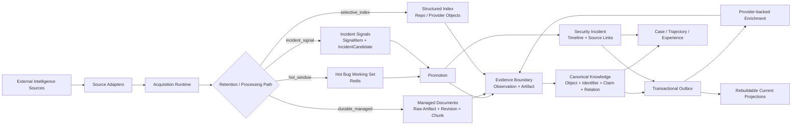

# SecFusionAgent

[English](README.md) | 中文

**Evidence-first AI Security Intelligence System**
**智能体驱动的 AI 安全情报融合与研判系统**

SecFusionAgent 面向 AI 安全漏洞、研究进展与安全事件构建持续演进的情报系统。系统从公开漏洞库、项目仓库、安全公告、研究论文和事件信息源持续获取新增或变化内容，把外部数据固定为可追溯的证据（evidence），再完成规范化、关联、富化、事件跟踪与后续调查。

这里的 Agent 建立在可验证的数据平面之上。外部读取带有 acquisition provenance，重要结论能够回到原始 observation / artifact，历史 revision 保留，current view 可重建；Agent 后续负责调查、工具调用与推理，不替代 evidence authority。

[Project Wiki](https://github.com/jiale-li-orion/SecFusionAgent/wiki) · [Requirements](https://github.com/jiale-li-orion/SecFusionAgent/wiki/Requirements-SPEC) · [Technical Design](https://github.com/jiale-li-orion/SecFusionAgent/wiki/Technical-Design) · [Repository Standard](PRODUCT-REPO-STANDARD.md) · [仓库规范](PRODUCT-REPO-STANDARD.zh.md)

## 项目状态

SecFusionAgent 当前处于 **M1–M3 Data Plane first-pass implementation / integration probe** 阶段。第一轮代码已经覆盖多种来源生命周期、canonical knowledge、provider-backed enrichment、Incident Watch、managed document、current projection，以及 Investigation Experience 的存储边界；PostgreSQL、Redis、MinIO 与 Celery 的真实基础设施集成仍在继续验证。

当前本地质量门：

```text
ruff        lint / import / Python correctness checks
mypy        static type checking
pytest      domain, replay, state-transition and contract tests
```

当前 fast suite 为 **29 tests**。这些测试主要使用 fixture 与轻量本地数据库验证 deterministic contract；它们不替代 PostgreSQL transaction、queue recovery、object storage、并发和部署层 integration tests。

## 系统概览



系统把 source protocol、runtime lifecycle、canonical knowledge 和 derived read model 分开维护：provider adapter 解释外部协议；acquisition runtime 记录每次 scheduled / on-demand read；EvidenceIngress 固定原始 revision；canonical knowledge 保存长期事实与 provenance；projection、cache 和后续 retrieval index 均属于可重建状态。

## 已实现的数据通路

| Path | 当前实现 | 用途 |
| --- | --- | --- |
| Hot Bug Stream | NVD CVE API → normalization → Redis hot working set → durable promotion | 保持高频漏洞 feed 的 freshness，同时避免把全部历史漏洞复制进本地长期库 |
| Vulnerability Enrichment | OSV / GitHub Global Advisory / CISA KEV → child AcquisitionRun → EvidenceIngress → claims / relations | 对已进入 durable knowledge 的漏洞补充 package、修复、KEV 与 advisory 信息 |
| Managed Content | arXiv Atom discovery → versioned PDF artifact → document revision → page-oriented chunks | 建设可长期演进、可回到具体 revision / page 的研究语料 |
| Structured Source Index | GitHub target repositories → repo revision cursor → `Repo` object / claims | 持续维护重点 AI infrastructure repository 的结构化状态 |
| Incident Watch | RSS breaking source → strong-anchor correlation → candidate watch → durable incident timeline | 将突发消息与后续独立证据组织成可持续富化的安全事件 |
| Current Projection | knowledge / incident change → transactional outbox → projection rebuild | 为 API 与后续 retrieval 提供低成本 current view，同时保留底层历史和冲突 |
| Investigation Memory | Case → append-only Trajectory → Experience candidate / version / evaluation | 为后续 Agent 调查保存可评测、可版本化的 procedural experience |

当前内置 source definitions 位于 [`config/sources/`](config/sources/)；source 是否进入 hot cache、durable corpus、structured index 或 incident staging，由 `SourceDefinition.retention_mode` 明确决定。

## 证据与知识模型

SecFusionAgent 将“来源看到的内容”和“系统当前认为可用的知识”区分存储。

`Observation`（观测）描述一次外部对象 revision 的获取；`EvidenceArtifact` 固定需要长期保留的原始内容产物；`EvidenceLink` 把 object、claim 或 relation 回连到 observation/artifact 与 locator。长期知识使用 `Object / ExternalIdentifier / Claim / Relation` 表达，并通过 knowledge revision 保存演进历史。

Snapshot 型 provider 的新 revision 会 supersede **同一来源**的旧 current claim / relation；来自不同来源的差异继续同时保留，由 current projection（投影）暴露 conflict 与 alternatives。数据修正因此不会覆盖历史，多源冲突也不会在 ingest 阶段被静默裁决。

所有 enrichment 产生的新外部读取都重新进入 `AcquisitionRun → IngestEnvelope → EvidenceIngress`，不会由 processor 直接把未经记录的 HTTP response 写成知识。

## 事件情报

Incident Watch 使用独立的 lifecycle。Breaking source 先进入短期 `SignalItem / IncidentCandidate` working set，只有达到晋升条件的事件才进入 durable incident storage。

多源确认按照“**独立来源支持同一个可验证 strong anchor**”计算。`upstream_source` 用于识别转载依赖，防止多个媒体转述同一原始消息后被错误计为独立 corroboration。当前 strong anchors 包括 CVE/GHSA、transaction hash、address、IOC、domain/IP、incident/advisory ID 和 commit 等可验证标识。

事件进入 durable state 后保留 append-only timeline 与 source links；后续官方说明、forensic analysis、资金流变化和影响范围更新继续追加，而不是反复覆盖一条静态新闻记录。

## 调查经验

调查过程被建模为 `Case` 与 append-only `Trajectory`。Trajectory 记录 provider query、tool call、evidence reference、使用过的 experience version、outcome、latency 与 cost，为后续 Agent Eval 和 replay 提供基础数据。

可复用经验（experience）进入独立的 versioned lifecycle：

```text
Trajectory
    ↓ extract
ExperienceCandidate
    ↓ evaluation / replay
validated
    ↓ activation
active
    ↓ superseded or invalidated
 deprecated
```

Experience 保存适用范围、trigger、推荐动作、evidence expectation、failure mode、stop condition 与 fallback。它属于 planning memory，不拥有 security evidence authority；后续任务仍需重新取得当前证据后才能形成事实结论。

## 仓库结构

```text
SecFusionAgent/
├── apps/
│   ├── api/                 # FastAPI application and HTTP routes
│   └── worker/              # Celery tasks, scheduler and outbox consumers
│
├── packages/
│   ├── sources/             # provider contracts, registry and source adapters
│   ├── monitoring/          # acquisition lifecycle and retention-mode collectors
│   ├── intelligence/        # evidence, canonical knowledge, incident and projections
│   ├── enrichment/          # provider-backed vulnerability enrichment
│   ├── investigation/       # Case, Trajectory and Experience lifecycle
│   └── shared/              # configuration, database and generic outbox primitives
│
├── config/
│   ├── sources/             # declarative SourceDefinition registry
│   └── env.example          # runtime configuration interface
│
├── alembic/                 # forward database migration history
├── deploy/                  # local/runtime deployment definitions
├── scripts/                 # engineering and probe entry points
├── tests/                   # repository-level architecture tests and fixtures
├── .github/                 # repository automation
├── PRODUCT-REPO-STANDARD.md
├── PRODUCT-REPO-STANDARD.zh.md
└── AGENTS.md
```

package ownership 与依赖方向属于仓库 contract，而不是目录约定。`packages/sources` 不拥有 scheduler state；`packages/monitoring/acquisition` 拥有 durable acquisition lifecycle；`packages/intelligence/knowledge` 拥有 canonical knowledge contract 与写入。[`tests/test_architecture_dependencies.py`](tests/test_architecture_dependencies.py) 自动检查这些依赖方向。

## 开发

### 前置条件

- Python **3.12+**
- [`uv`](https://docs.astral.sh/uv/)
- 支持 Compose 的 Docker，用于本地 PostgreSQL / Redis / MinIO 栈

runtime 不依赖任何云厂商。容器镜像仓库 mirror、proxy 与凭据属于 host 级配置，被有意排除在仓库 contract 之外。

### 安装依赖

```bash
make sync
```

等价命令：

```bash
uv sync --dev
```

### 配置环境

[`config/env.example`](config/env.example) 定义受支持的配置面。导出所需的 `SECFUSION_*` 变量，或通过本地环境管理加载等价取值。

默认开发拓扑使用相互隔离的 Redis failure domain：

- `redis-broker`：采用 `noeviction` policy 的 durable-ish 任务传输；
- `redis-cache`：Hot Bug 与 Incident staging 使用的有界 LFU working set。

允许匿名访问的 source 可以不配置 API key，但 provider rate limit 会显著降低。secret 一律不得提交进仓库。

### 启动本地基础设施

```bash
make dev-up
make migrate
make sync-sources
```

这会启动本地 PostgreSQL/pgvector、Redis Broker、Redis Hot Cache 与 MinIO 服务，应用 Alembic migrations，然后把声明式 source definitions 同步进 runtime state。

停止本地栈：

```bash
make dev-down
```

### 运行 API

```bash
uv run uvicorn apps.api.main:app --reload
```

当前 HTTP 面包括：

```text
GET /health/live
GET /api/v1/vulnerabilities/{cve_id}
```

API 读取 canonical knowledge/current repository state，不会绕过 ingestion 与 evidence 通路直接查询 provider。

### 运行采集与后台 worker

启动 scheduler：

```bash
make scheduler
```

当前 task 拓扑为 collection、enrichment 与 indexing/projection 工作使用相互独立的 Celery queue。完整本地开发时，启动订阅活跃 queue 的 worker：

```bash
uv run celery -A apps.worker.celery_app:celery_app worker \
  -l INFO \
  -Q collection,enrichment,indexing
```

`make worker` 目前只启动 collection queue，用于隔离 M1 collection 行为。

### 运行聚焦 probe

把一小段 NVD modification window 采集进 Hot Bug working set：

```bash
make probe-nvd
```

把一条缓存 CVE 晋升为 durable evidence 与 canonical knowledge：

```bash
make promote-hot CVE=CVE-YYYY-NNNN
```

probe 用于回答有边界的集成问题。稳定的产品行为应落在 package、migration 与测试中，而不是在 scripts 里不断累积。

## 质量门

提交变更前运行完整本地质量门：

```bash
make check
```

针对聚焦变更迭代时可单独运行：

```bash
make lint
make typecheck
make test
```

`make check` 是开发期间使用的仓库级可复现质量门。涉及 persistence、queue、外部 adapter 或部署的变更，在对应基础设施可用后还需运行相关 integration probe。

## 工程不变量

当前实现围绕若干不变量组织，这些不变量应在 code review 中保持可见：

1. 重要知识始终可追溯到证据。
2. durable 的原始证据不可变；派生状态可重建。
3. 外部内容是不可信输入，包括后续会被 LLM 消费的内容。
4. 新的 provider 读取产生可观测的 acquisition 状态，而不是绕过 M1/M2。
5. replay 与 retry 依赖稳定的幂等键与版本化状态。
6. 同源修正保留历史；跨源分歧保持显式。
7. Agent trajectory 与可复用经验可观测、可版本化。
8. package 依赖遵循 ownership 方向并保持无环。

这些决策的详细理由、failure case 与重新审视条件维护在项目 Wiki 中，而不重复写进源码注释或本 README。

## 文档

代码仓库与 Wiki 拥有不同的职责边界：

- **Repository** — 可执行源码、测试、migration、部署定义、scripts、CI 与仓库治理。
- **Wiki** — requirements、Technical Design、数据源语义、安全领域专题、设计决策、probe、运行手册与项目演进。

建议从以下内容开始：

- [Requirements SPEC](https://github.com/jiale-li-orion/SecFusionAgent/wiki/Requirements-SPEC) — 产品范围、约束与验收语义。
- [Technical Design](https://github.com/jiale-li-orion/SecFusionAgent/wiki/Technical-Design) — runtime 架构、存储语义、M1–M3 处理通路与实现基线。
- [Data Sources and Processing](https://github.com/jiale-li-orion/SecFusionAgent/wiki/01-Data-Sources-and-Processing) — source 分类、生命周期与数据语义。
- [CTI Baseline Reuse and Ownership](https://github.com/jiale-li-orion/SecFusionAgent/wiki/02-CTI-Baseline-Reuse-and-Ownership) — CTI 能力边界与复用策略。
- [Normative Knowledge and Policy](https://github.com/jiale-li-orion/SecFusionAgent/wiki/03-Normative-Knowledge-and-Policy) — 标准、policy 与规范性知识。
- [AI / Model / Data / Agent Security](https://github.com/jiale-li-orion/SecFusionAgent/wiki/04-AI-Model-Data-and-Agent-Application-Security) — AI 特定风险语义。
- [Incident & News Intelligence](https://github.com/jiale-li-orion/SecFusionAgent/wiki/05-Incident-News-Intelligence) — incident source 角色、关联与事件生命周期。

仓库组织与贡献规则由 [`PRODUCT-REPO-STANDARD.md`](PRODUCT-REPO-STANDARD.md) 和 [`PRODUCT-REPO-STANDARD.zh.md`](PRODUCT-REPO-STANDARD.zh.md) 定义。Agent 参与的变更还需遵循 [`AGENTS.md`](AGENTS.md)。

## 路线图

下一个工程边界是从 first-pass Data Plane 过渡到经过验证的 runtime 与 retrieval 基础设施：

- 完成 PostgreSQL / Redis / MinIO / Celery integration probe 与 recovery 测试；
- 把 GitHub 监控从 repository metadata 扩展到 issue / PR / commit / release 关系；
- 在第一条 RSS breaking-source 通路之外补充 primary 与 forensic Incident source；
- 把 Managed Content 扩展到 HTML source 与语义抽取；
- 在 current/canonical knowledge 之上实现可重建的 sparse + dense retrieval 与 query construction；
- 把 Investigation Case / Trajectory 状态接入 Agent runtime；
- 为 enrichment、retrieval、QA、Agent trajectories 与 Experience activation 建立固定的 M7 evaluation 协议；
- 针对被投毒 source、indirect prompt injection、恶意 tool output 与权限边界补充 security regression。

Requirements 仍是产品范围的 authority；roadmap 排序依据依赖与集成风险，而不是 UI 完成度。
